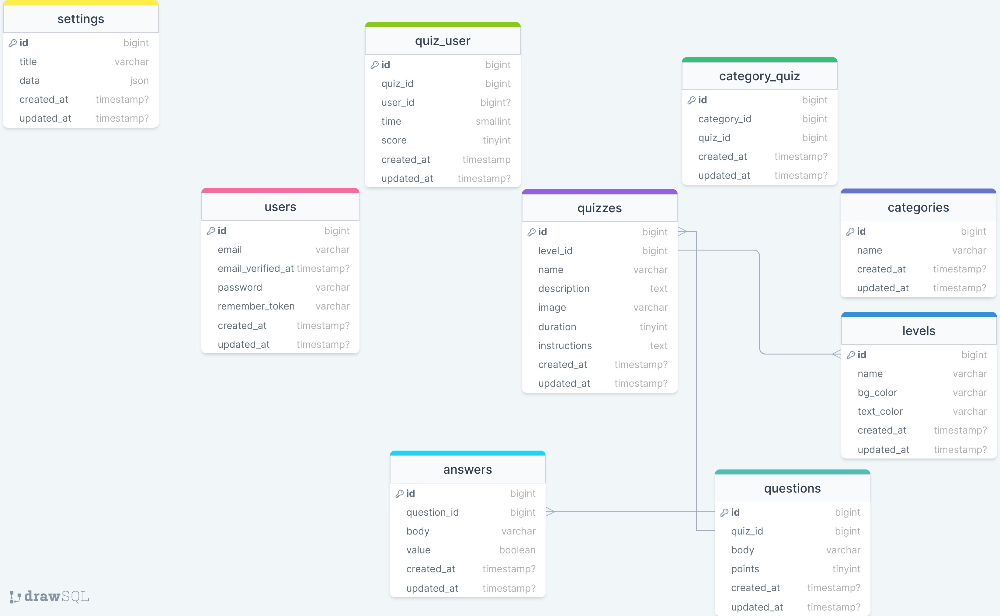

# QuizWiz-API

---

This is the api for QuizWiz web app (https://github.com/RedberryInternship/front-quizwiz-luka-jikia.git) which is a platform, where we have access to vast number of quizzes of different genres.

---

### Table of Contents

* [Prerequisites](#prerequisites)
* [Tech Stack](#tech-stack)
* [Getting Started](#getting-started)
* [Migrations](#migration)
* [Development](#development)
* [Usage](#usage)
* [Resources](#resources)

### Prerequisites

*  *PHP@8.2*
*  *MYSQL@8 and up*
*  *npm@10 and up*
*  *composer@2 and up*

### Tech Stack

*  [Laravel@11.x](https://laravel.com/docs/11.x) - The PHP Framework
*  [Laravel Nova] (https://nova.laravel.com/) - Package for managing administration panel

### Getting Started

1. First of all you need to clone QuizWiz-API repository from GitHub:

```sh
git clone https://github.com/RedberryInternship/api-quizwiz-luka-jikia.git
```

2. Next step requires you to run *composer install* in order to install all the dependencies.

```sh
composer install
```

3. After you have installed all the PHP dependencies, it's time to install all the JS dependencies:

```sh
npm install
```

4. Now we need to set our **.env** file. Go to the root of your project and execute this command.

```sh
cp .env.example .env
```

And now you should provide **.env** file all the necessary environment variables:

**MYSQL:**
> DB_CONNECTION=mysql

> DB_HOST=127.0.0.1

> DB_PORT=3306

> DB_DATABASE=*****

> DB_USERNAME=*****

> DB_PASSWORD=*****

**Sanctum:**
> FRONTEND_URL=url:port

> SANCTUM_STATEFUL_DOMAINS=url:port

> SESSION_DOMAIN=url:port

**Storage:**
> FILESYSTEM_DISK=public


**Mailing:**
> MAIL_MAILER=

> MAIL_HOST=

> MAIL_PORT=

> MAIL_USERNAME=

> MAIL_PASSWORD=

> MAIL_ENCRYPTION=

> MAIL_FROM_ADDRESS=

> MAIL_FROM_NAME="${APP_NAME}"

After setting up **.env** file, in the root of you project execute:

```sh
php artisan key:generate
```

which generates auth key.

This api uses Laravel Sanctum for authentication, so we need to install it by running:
```sh
php artisan install:api
```

To make files publicly accessible execute:

```sh
php artisan storage:link
```

You may additionally need to change default filesystem disk in ***filesystems.php***:
> 'default' => env('FILESYSTEM_DISK', 'public'),

##### Now, you should be good to go!

### Migration

If you've completed getting started section, then migrating database if fairly simple process, just execute:

```sh
php artisan migrate
```

### Development

You can run built-in Laravel development server by executing:

```sh
php artisan serve
```

### Usage
You must visit `your_app_url:port/nova` to see administration panel and use pre-registered user's credentials:

`email`: `test@test.com`

`password`: `test`

### Resources

* **Database Design Diagram** 
